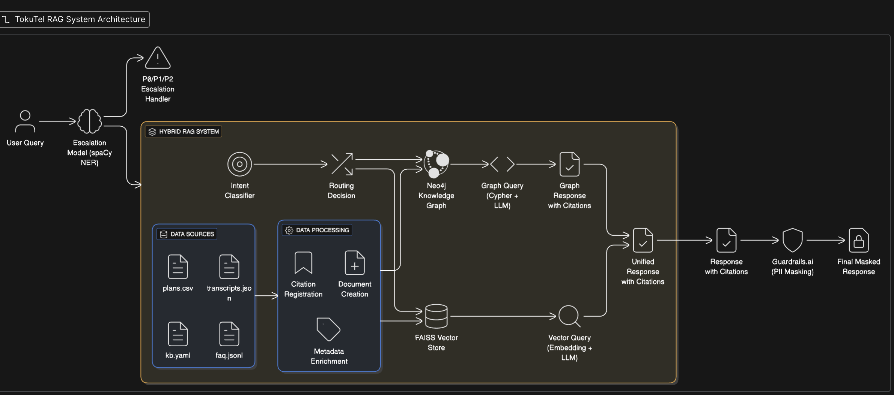

# System Architecture Overview



## Table of Contents
- [Why Hybrid RAG Over Traditional RAG](#why-hybrid-rag-over-traditional-rag)
- [Three-Stage Processing Pipeline](#three-stage-processing-pipeline)
- [Knowledge Graph Design & Benefits](#knowledge-graph-design--benefits)
- [Current Limitations & Trade-offs](#current-limitations--trade-offs)
- [Production Recommendations](#production-recommendations)
- [Security Architecture: Multi-Model Approach](#security-architecture-multi-model-approach)
- [Future Enhancements](#future-enhancements)
- [Conclusion](#conclusion)

---

## Why Hybrid RAG Over Traditional RAG

### Limitations of Conventional RAG Systems

Traditional RAG systems rely solely on vector similarity search, which suffers from several critical limitations in enterprise contexts:

#### 1. **Loss of Structural Relationships**
- Vector embeddings flatten relational data into high-dimensional space
- Business relationships (Plan → Features, Customer → Region) become implicit
- Query: "Which plans support call recording?" requires traversing explicit relationships, not semantic similarity

#### 2. **Inconsistent Retrieval for Factual Queries**
- Vector search can return semantically similar but factually incorrect documents
- No guarantee that "How many plans are available?" returns all plans , the problem becomes more pronounced as document size grows with limited top-k chunks similarity
- Embedding models may conflate similar concepts (e.g., "call recording" vs "call analytics")

#### 3. **Limited Query Complexity Handling**
- Pure vector search struggles with multi-hop reasoning
- Cannot efficiently handle queries requiring aggregation or precise filtering
- Example: "Show customers in Singapore with call recording issues" requires both filtering and semantic matching

#### 4. **Citation Tracking Challenges**
- Vector chunks lose connection to original data sources
- Difficult to provide precise, auditable citations
- Business compliance requires exact source traceability

### Knowledge Graph Advantages

GraphRAG addresses these limitations by incorporating structured domain knowledge. By tapping into the semantic relationships inside a knowledge graph, GraphRAG enhances retrieval accuracy, supports reasoning, and delivers more trustworthy results while still maintaining the flexibility of vector search.

#### 1. **Explicit Relationship Modeling**
```cypher
(Plan)-[:SUPPORTS]->(Feature)
(Customer)-[:HAS_INTERACTION]->(Transcript)
(Plan)-[:AVAILABLE_IN]->(Region)
```

#### 2. **Precise Query Execution**
- Cypher queries guarantee completeness and accuracy
- Structural queries bypass embedding model limitations
- Direct relationship traversal for complex business logic

#### 3. **Native Citation Support**
- Each node contains exact source location metadata
- Preserves data lineage and audit trails
- Enables compliance with regulatory requirements

---

## Three-Stage Processing Pipeline

### Stage 1: Escalation Detection (spaCy NER Model)

```python
incident_classification = spacy_model(user_query)
if confidence > 0.98:
    escalate_to_level(predicted_level)  # P0/P1/P2
    return escalation_response
```

**Technical Implementation:**
- A basic Custom spaCy  model trained on escalation policies(training note book included).
- Categories: P0 , P1 , P2 
- High confidence threshold (0.98) prevents false escalations
-For production use cases , we can finetune a SLM for better results.

**Security Rationale:**
- Isolated model prevents prompt injection attacks
- No context from previous conversations
- Deterministic escalation based on incident severity

### Stage 2: Hybrid RAG System

#### Intent Classification Engine

The intent classfication Engine , routes the query  either to knoweldge graph or vector similarity.
Here I have employed a rule based mechanism  due to a smaller dataset ,for robust usecases we could use  finetuned  BERT or any other smaller models at a cost of latency. 

#### Graph Query Path (Neo4j + GraphCypherQAChain)
- **Use Cases**: Structural queries, relationship traversal, aggregations
- **Technology Stack**: Neo4j(Graph database) + Gemini LLM + Custom Cypher prompts depicting the schema

```cypher
MATCH (p:Plan)-[:SUPPORTS]->(f:Feature {name: "call_recording"})
RETURN p.name, p.price_usd, p.citation
```

#### Vector Query Path (FAISS + HuggingFace Embeddings)
- **Use Cases**: Semantic search, customer service scenarios, content similarity
- **Technology Stack**: FAISS + sentence-transformers/all-mpnet-base-v2
- **Retrieval Strategy**: Unified vector store with relevance filtering 

### Stage 3: Guardrails.ai PII Masking

I have leveraged one of the popular open source framework i,e gaurdrail.ai  which uses microsofts presidio, we can control the degree of masking and what entities to mask.

```python
guard = Guard().use(DetectPII(pii_entities="pii", on_fail="fix"))
original, masked = guard.parse(llm_output)
final_response = mask_phone_numbers(original, masked)
```

**Technical Implementation:**
- Microsoft Presidio-anonymizer with spaCy backend
- Custom phone number masking (preserves last 3 digits: xxxx567)
- Post-processing pipeline ensures no PII leakage

**Architecture Benefits:**
- Final stage processing prevents context pollution
- Isolated from main RAG system
- Deterministic PII detection and replacement

---

## Knowledge Graph Design & Benefits

### Entity-Relationship Model
```
Company
├── Plans (plan_id, name, region, price, features)
├── Features (feature_name, supported_plans)
├── Customers (name, region, interactions)
└── Policies (SLA, escalation, pricing_rules)
```

### Business Logic Advantages

#### 1. **Feature Compatibility Queries**
Traditional RAG might return semantically similar but incompatible plans. Knowledge graph ensures factual accuracy:
```cypher
MATCH (p:Plan)-[:SUPPORTS]->(f:Feature {name: "sso"})
WHERE p.region = "SG"
RETURN p.name, p.price_usd
```

#### 2. **Customer Context Preservation**
Graph maintains customer interaction history and regional context:
```cypher
MATCH (c:Customer {region: "SG"})-[:HAS_INTERACTION]->(t:Transcript)
WHERE t.text CONTAINS "whatsapp"
RETURN c.name, t.text, t.citation
```

#### 3. **Policy Enforcement**
Pricing rules and discount eligibility encoded as graph relationships:
```cypher
MATCH (p:Plan) WHERE p.price_usd < 50
RETURN p.name, p.citation
```

### Performance Benefits
- **Query Latency**: Sub-second response for structural queries
- **Data Consistency**: Single source of truth for business relationships
- **Scalability**: Neo4j optimized for relationship traversal

---

## Current Limitations & Trade-offs

### Dataset Size Constraints
- **No Chunking Strategy**: Small dataset (< 1000 documents) doesn't warrant sophisticated chunking and is a overkill
- **Production Requirement**: Implement hierarchical chunking for larger corpora
- **Memory Efficiency**: Current approach loads entire dataset into memory

### Embedding Model Limitations
- **Dimension Constraint**: 768-dimensional embeddings limit semantic representation
- **Production Upgrade**: Consider 1536+ dimensional models (OpenAI ada-002, Cohere embed-v3)
- **Domain Adaptation**: Fine-tune embeddings on telecom-specific vocabulary

### Model Architecture Trade-offs
- **spaCy vs. Transformer Models**: spaCy chosen for speed and simplicity
- **Production Alternative**: Fine-tuned small language model (SLM) for escalation detection
- **Robustness**: Current model trained on limited synthetic data

### Context Management
- **Stateless Design**:  Due to limit in dataset size , I have resorted to simple prompt answering as given in the examples and eval_prompt. No conversation history or context preservation
- **Memory Limitation**: Each query processed independently
- **User Experience**: Cannot handle follow-up questions or clarifications

---

## Production Recommendations

### 1. Advanced Retrieval Architecture
```python
# Multi-stage retrieval pipeline
retrieval_stages = [
    HybridRetriever(graph_weight=0.3, vector_weight=0.7),
    ReRankingModel(cross_encoder="ms-marco-MiniLM"),
    ContextualCompressor(llm_chain=True)
]
```

### 2. Embedding Model Upgrades
- **Higher Dimensional Models**: 1536+ dimensions for richer semantic representation
- **Domain-Specific Fine-tuning**: Train on telecom industry corpus
- **Multilingual Support**: Support for regional languages (Bahasa, Thai, etc.)

### 3. Conversation Memory Architecture
For a more personalized chatbot we can have episodic memory in redis and semantic memeory in vector db and maintain a session in the backend served via websocket.
```python
conversation_stack = {
    "episodic_memory": RedisCache(ttl=3600),      # Recent context
    "semantic_memory": PineconeIndex(),           # Long-term patterns  
    "working_memory": ContextWindow(size=8192)    # Active conversation
}
```

### 4. Advanced Chunking Strategies
- **Semantic Chunking**: Preserve business entity boundaries
- **Hierarchical Indexing**: Multi-level document organization
- **Overlap Management**: Sliding window with business logic awareness

---

## Security Architecture: Multi-Model Approach

### Jailbreak Prevention Strategy
Our architecture implements defense-in-depth through model isolation:

#### 1. **Escalation Model Isolation**
- **Purpose**: Prevent prompt injection in critical path
- **Implementation**: Standalone spaCy model, no LLM interaction
- **Attack Surface**: Minimal - only processes incident text classification

#### 2. **RAG System Separation**
- **Context Isolation**: Each query processed independently
- **Prompt Engineering**: System prompts hardcoded, user input sanitized
- **Data Grounding**: Responses strictly limited to provided context

#### 3. **Guardrails Post-Processing**
- **Final Safety Layer**: PII detection operates on generated response only
- **No Context Access**: Masking model cannot be manipulated through conversation history
- **Deterministic Operation**: Rule-based PII detection, not LLM-based

### Threat Model Coverage
- **Prompt Injection**: Multi-stage processing prevents context pollution
- **Data Exfiltration**: Citation system ensures only approved sources
- **Context Manipulation**: Stateless design prevents conversation hijacking

---

## Future Enhancements

### 1. **Advanced Memory Systems**
- **Episodic Memory**: Redis for short-term conversation context
- **Semantic Memory**: Long-term user preference and pattern storage
- **Working Memory**: Dynamic context window management

### 2. **Multi-Modal Capabilities**
- **Document Processing**: OCR for scanned policies and contracts
- **Voice Integration**: Speech-to-text for call center integration
- **Visual Analytics**: Chart and diagram interpretation

### 3. **Real-Time Learning**
- **Feedback Integration**: User satisfaction scoring for retrieval improvement
- **Continuous Training**: Incremental model updates with new support interactions
- **A/B Testing**: Query routing optimization based on success metrics

### 4. **Enterprise Integration**
- **Single Sign-On**: Authentication with corporate identity providers
- **API Gateway**: Rate limiting and usage analytics
- **Audit Logging**: Complete query and response traceability

---

## Conclusion

This hybrid architecture addresses the fundamental limitations of traditional RAG systems by combining the precision of knowledge graphs with the flexibility of vector search. The three-stage pipeline ensures both security and accuracy, while the modular design enables incremental improvements toward production readiness.

The knowledge graph provides structured query capabilities essential for telecom business logic, while vector search handles the semantic understanding required for customer service scenarios. This architectural decision directly addresses the assignment's requirement for grounded, citable responses while maintaining system security through model isolation.